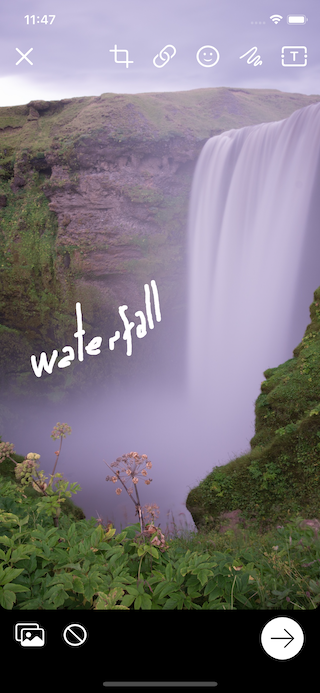
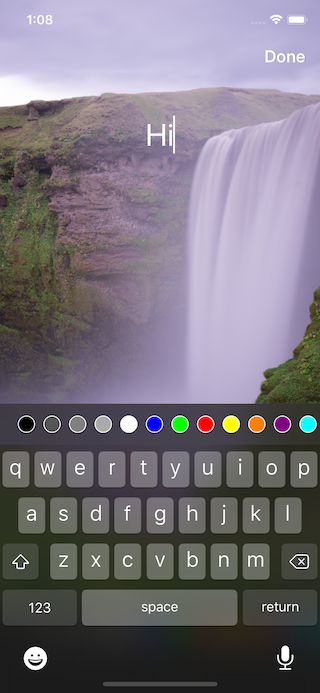
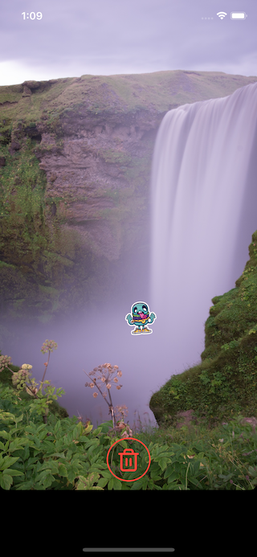

# iOS Photo Editor

## Features

- [x] Cropping
- [x] Adding images - **Stickers**
- [x] Adding Text with colors
- [x] Drawing with colors
- [x] Scaling and rotating objects
- [x] Deleting objects
- [x] Saving to photos and Sharing
- [x] Cool animations
- [x] Uses iOS Taptic Engine feedback

## Installation

### CocoaPods

[CocoaPods](http://cocoapods.org) is a dependency manager for Cocoa projects. You can install it with the following command:

```bash
gem install cocoapods
```

To integrate iOS Photo Editor into your Xcode project using CocoaPods, specify it in your `Podfile`:

```ruby
source 'https://github.com/CocoaPods/Specs.git'
platform :ios, '10.0'
use_frameworks!

target '<Your Target Name>' do
    pod 'iOSPhotoEditor'
end
```

Then, run the following command:

```bash
pod install
```

## Usage

### Photo

The `PhotoEditorViewController`.

```swift
let photoEditor = PhotoEditorViewController()

//PhotoEditorDelegate
photoEditor.photoEditorDelegate = self

//The image to be edited
photoEditor.image = image

//Stickers that the user will choose from to add on the image
photoEditor.stickers.append(UIImage(named: "sticker")!)

//Optional: To hide controls - array of enum control
photoEditor.hiddenControls = [.crop, .draw, .share]

//Optional: Colors for drawing and Text, If not set default values will be used
photoEditor.colors = [.red,.blue,.green]

//Present the View Controller
present(photoEditor, animated: true)
```

The `PhotoEditorDelegate` methods.

```swift
func doneEditing(image: UIImage) {
    // the edited image
}

func canceledEditing() {
    print("Canceled")
}
```

<p float="left">
    
    
    
    
</p>

## Live Demo appetize.io

[](https://appetize.io/app/jtanmwtzbz1favhvhw5g24n7b0?device=iphone7plus&scale=50&orientation=portrait&osVersion=10.3)

## Credits

Written by [Mohamed Hamed](https://github.com/M-Hamed).

Initially sponsored by [](http://eventtus.com)

## License

Released under the [MIT License](http://www.opensource.org/licenses/MIT).
